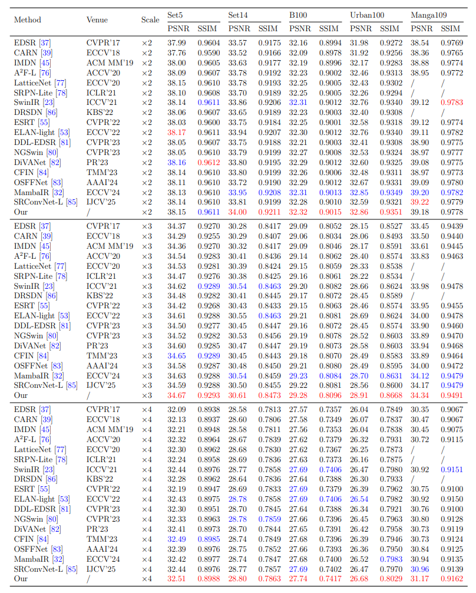

[//]: # (<p align="center">)

[//]: # (    )

[//]: # (</p>)

## MFPMamba: Mamba with multi-frequency perception for image super-resolution

[Huimin Yang], [Jingzhong Xiao]* [Ji Zhang], [Xuchuan Zhou], [Yuxing Liu]

> **Abstract:**   Single Image Super-Resolution (SISR) focuses on reconstructing high-resolution (HR) image from low-resolution (LR) input, aiming to restore fine details and improve perceptual quality. Recently, the Visual State Space Model (Mamba) has shown promise in SISR due to its efficient sequential modeling capability. However, existing Mamba-based approaches often neglect the joint impact of remote-distance information decay and insufficient local information dependencies. To address this issue, we propose MFPMamba, a novel image super-resolution method designed to enhance both the global and local feature representation capabilities of Mamba. Specifically, a MultiFrequency Decoupling Perception (MFDP) module is introduced to augment the Mamba with frequency domain information. In this module, feature are decomposed into low- and high-frequency components via the Wavelet Transform, and specialized decoupled convolutions are employed to effectively process each component. In addition, a Multi-Domain Adaptive Fusion (MDAF) module is developed to facilitate the integration of spatial domain features encoded by Mamba and the frequency domain features encoded by MFDP. In which, channel weights are adaptively determined through the uniform quantification of features across different domains. Extensive experiments have shown that state-of-the-art performance is achieved. In the ×4 task, our method improves the PSNR by 0.16 dB and 0.25 dB on the Urban100 and Manga109 datasets respectively over the baseline. Meanwhile, reducing memory consumption by 12%. These results demonstrate the effectiveness of multi-frequency perception to assist Mamba in achieving image superresolution.

[//]: # (⭐If this work is helpful for you, please help star this repo. Thanks!🤗)

## 📑 Contents

- [Visual Results](#visual_results)
- [Model Summary](#model_summary)
- [Results](#results)
- [Training](#training)
- [Testing](#testing)
- [Acknowledgements](#acknowledgements)

[//]: # (- [Citation]&#40;#cite&#41;)


## <a name="visual_results"></a> 👁️ Visual Results
### x2 visual_result, you can download from: 
[x2_visualResult](https://drive.google.com/drive/folders/15iifLOeikT16Up7z-JAJmNu9WmCIv1b5?hl=zh-cn) 
<p>
    
</p>

### x2 visual_result, you can download from: 
[x3_visualResult](https://drive.google.com/drive/folders/15iifLOeikT16Up7z-JAJmNu9WmCIv1b5?hl=zh-cn)
<p>
    
</p>

### x2 visual_result, you can download from: 
[x4_visualResult](https://drive.google.com/drive/folders/15iifLOeikT16Up7z-JAJmNu9WmCIv1b5?hl=zh-cn)
<p>
    
</p>


## <a name="model_summary"></a> 🔍 Model Summary

| Model                | Test_dataset | PSNR  | SSIM   | model_weights |
|----------------------|--------------|-------|--------|:---------:|
| MFPMamba_SR2         | Set14        | 34.00 | 0.9211 |   [link](https://drive.google.com/drive/folders/15iifLOeikT16Up7z-JAJmNu9WmCIv1b5?hl=zh-cn)    |
| MFPMamba_SR3         | Set14        | 30.61 | 0.8473 |   [link](https://drive.google.com/drive/folders/15iifLOeikT16Up7z-JAJmNu9WmCIv1b5?hl=zh-cn)    |
| MFPMamba_SR4         | Set14        | 28.80 | 0.7863 |   [link](https://drive.google.com/drive/folders/15iifLOeikT16Up7z-JAJmNu9WmCIv1b5?hl=zh-cn)    |

## <a name="r[LICENSE](LICENSE)esults"></a> 🥇 Results

We achieve state-of-the-art performance on image super-resolution. Detailed results can be found in the paper.
<p>
    
</p>

## 📁 Datasets

The datasets used in our training and testing are orgnized as follows: 


| Task                                          |                               Training Set                               |                                                                Testing Set                                                                 |
| :-------------------------------------------- |:------------------------------------------------------------------------:|:------------------------------------------------------------------------------------------------------------------------------------------:|
| image SR                                      | [DIV2K](https://data.vision.ee.ethz.ch/cvl/DIV2K/) (800 training images) | Set5 + Set14 + B100 + Urban100 + Manga109 [[download](https://drive.google.com/file/d/1n-7pmwjP0isZBK7w3tx2y8CTastlABx1/view?usp=sharing)] |

## <a name="training"></a> 🧠 Training
1. Please download the corresponding training datasets and download the testing datasets.

2. Follow the instructions below to begin training our model.

```
# SR task, cropped input=64×64, 2 GPUs, batch size=16 per GPU
python -m torch.distributed.launch --nproc_per_node=2 --master_port=1234 basicsr/train.py -opt options/train/train_MFPMamba_lightSR_x2.yml --launcher pytorch
python -m torch.distributed.launch --nproc_per_node=2 --master_port=1234 basicsr/train.py -opt options/train/train_MFPMamba_lightSR_x3.yml --launcher pytorch
python -m torch.distributed.launch --nproc_per_node=2 --master_port=1234 basicsr/train.py -opt options/train/train_MFPMamba_lightSR_x4.yml --launcher pytorch
```
Run the script then you can find the generated experimental logs in the folder experiments.

## <a name="testing"></a> 😄 Testing

1. Please download the corresponding testing datasets and download the corresponding models.

2. Follow the instructions below to begin testing our MambaIRv2 model.

```
# test for image SR. 
python basicsr/test.py -opt options/test/test_MFPMamba_lightSR_x2.yml
python basicsr/test.py -opt options/test/test_MFPMamba_lightSR_x3.yml
python basicsr/test.py -opt options/test/test_MFPMamba_lightSR_x4.yml
```
## <a name="acknowledgements"></a> 🙏 Acknowledgements

We adopt [MambaIR](https://github.com/csguoh/MambaIR) as a baseline in our experiments. Thanks for their awesome work.


[//]: # (## <a name="cite"></a> 🥰 Citation)

[//]: # ()
[//]: # (Please cite us if our work is useful for your research.)

[//]: # ()
[//]: # (```)

[//]: # (@inproceedings{guo2025mambair,)

[//]: # (  title={MambaIR: A simple baseline for image restoration with state-space model},)

[//]: # (  author={Guo, Hang and Li, Jinmin and Dai, Tao and Ouyang, Zhihao and Ren, Xudong and Xia, Shu-Tao},)

[//]: # (  booktitle={European Conference on Computer Vision},)

[//]: # (  pages={222--241},)

[//]: # (  year={2024},)

[//]: # (  organization={Springer})

[//]: # (})

[//]: # (```)

[//]: # ()
[//]: # (```)

[//]: # (@article{guo2024mambairv2,)

[//]: # (  title={MambaIRv2: Attentive State Space Restoration},)

[//]: # (  author={Guo, Hang and Guo, Yong and Zha, Yaohua and Zhang, Yulun and Li, Wenbo and Dai, Tao and Xia, Shu-Tao and Li, Yawei},)

[//]: # (  journal={arXiv preprint arXiv:2411.15269},)

[//]: # (  year={2024})

[//]: # (})

[//]: # (```)

[//]: # ()
[//]: # (## License)

[//]: # ()
[//]: # (This project is released under the [Apache 2.0 license]&#40;LICENSE&#41;.)

[//]: # ()
[//]: # (## Acknowledgement)

[//]: # ()
[//]: # (This code is based on [BasicSR]&#40;https://github.com/XPixelGroup/BasicSR&#41;, [ART]&#40;https://github.com/gladzhang/ART&#41; ,and [VMamba]&#40;https://github.com/MzeroMiko/VMamba&#41;. Thanks for their awesome work.)

[//]: # ()
[//]: # (## Contact)

[//]: # ()
[//]: # (If you have any questions, feel free to approach me at cshguo@gmail.com)

